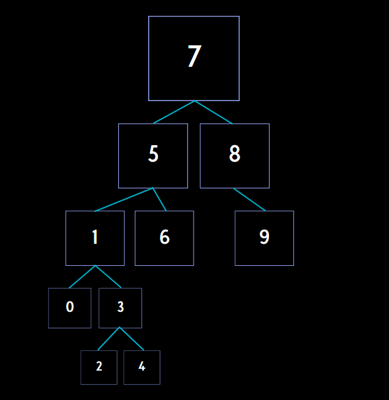

# Binary Search Tree Aşamaları

Dizi: [7, 5, 1, 8, 3, 6, 0, 9, 4, 2]

## Aşamalar

1. Root 7'dir.

2. 5, 7'den küçük, soluna eklenir.
   
3. 1, 7'den ve 5'ten küçük, 5'in soluna eklenir.
   
4. 8, 7'den büyük, sağına eklenir.
   
5. 3, 7'den ve 5'ten küçük, 1'den büyük, 1'in sağına eklenir.
   
6. 6, 7'den küçük, 5'ten büyük, 5'in sağına eklenir.
   
7. 0, hepsinden küçük, 1'in soluna eklenir.
   
8. 9, 7 ve 8'den büyük, 8'in sağına eklenir.
   
9. 4, 7 ve 5'ten küçük, 1 ve 3'ten büyük, 3'ün sağına eklenir.
   
10. 2, 7 ve 5'ten küçük, 1'den büyük, 3'ten küçük, 3'ün soluna eklenir.

## Sonuç

